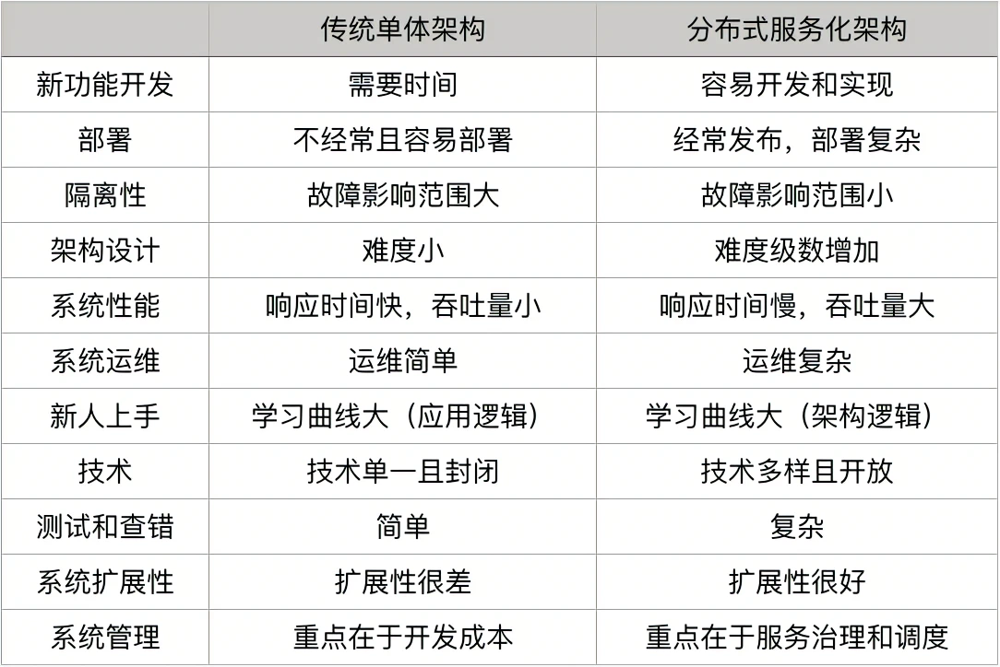

## 分布式系统架构的冰与火
1. 使用分布式系统主要有两方面原因：增大系统容量、加强系统可用
2. 单体应用和分布式架构的优缺点

3. 分布式系统的发展
   单体 -> SOA -> 微服务

## 从亚马逊的实践，谈分布式系统的难点

构建分布式系统非常难，这其中充满了各种各样的挑战，但亚马逊还是毫不犹豫地走了下去。这是因为亚马逊想做平台，不是“像淘宝这样的中介式流量平台”，而是那种“可以对外输出能力的平台”。

亚马逊实践:
1. 分布式服务的架构需要分布式的团队架构
2. 分布式服务查错不容易
3. 没有专职的测试人员，也没有专职的运维人员，开发人员做所有的事情
4. 运维优先，崇尚简化和自动化
5. 内部服务和外部服务一致

分布式系统中需要注意的问题:
1. 异构系统的不标准问题
   1. 软件和应用不标准。 
   2. 通讯协议不标准。 
   3. 数据格式不标准。
   4. 开发和运维的过程和方法不标准。
2. 系统架构中的服务依赖性问题
   1. 如果非关键业务被关键业务所依赖，会导致非关键业务变成一个关键业务。
   2. 服务依赖链中，出现“木桶短板效应”——整个 SLA 由最差的那个服务所决定。
3. 故障发生的概率更大
   1. **出现故障不可怕，故障恢复时间过长才可怕。**
   2. **出现故障不可怕，故障影响面过大才可怕。**
   3. “防火胜于救火”，我们还要考虑如何防火，这需要我们在设计或运维系统时都要为这些故障考虑，即所谓 Design for Failure。
4. 多层架构的运维复杂度更大

   通常来说，我们可以把系统分成四层：基础层、平台层、应用层和接入层。

「此文章为3月Day1学习笔记，内容来源于极客时间《左耳听风》，强烈推荐该课程！」